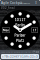

# __Agile Cockpit__ for Pebble Smartwatch

Highly configurable analog watchface, which solves the problem of scheduling in daily business. 
With a connected Google Calendar, you will see upcoming appointments directly on your wrist and, if you wish, you will be notified on time.

With the Agile Cockpit you get the possibility to fetch data via GET Requests and display them as dashboard elements on your watchface.
And because the possibilities of your customized watchface increased so much, it also offer a way to backup and restore your watchface settings.

And ... even without a linked calendar or smart dashboards, the clock is just fun. You can create and save up to ten personal clock faces. 
And if it has to go fast, the random clock face generator will help you in this case!

## Find yours in the __Themes__ section 

 ...

## Benefits
1. Highly configurable watchface
1. Fetch 'Custom Values' from public APIs via GET requests
1. Use variables and placeholder to manage dashboard elements
1. Show appointments of one public google calendar in circular manner
1. Get notified about your next appointment
1. Backup, share and restore your personal watchface creation
1. 10 clock face presets
1. Memory slots for 10 custom clock faces
1. Configurable random generator

## Supported Pebbles
- ~~Classic, Steel~~
- Time, Time Steel
- Time Round
- Pebble 2

# Motivation

I love each of my Pebbles over all 🙂 and because there are many enthusiast developer keeping the pebble smartwatch and the ecosystem a live I try to fulfill a small dream of me.

For a long time I had the vision of a flexible watch face that can be adapted to a wide variety of needs. It should help in work as well as in everyday life but should also be able to cover other areas. The idea: Different watch faces for different purposes that can be saved, exported and shared.

Many ideas had to be bundled in one watchface.
The clock face should be varied and a calendar should be linked. Several dashboards should be able to be customized and public APIs should be addressable. There should be an import / export function and the watchface should get by without an external server or companion app.

With 'Agile Cockpit' this vision has come true ... and for me a little dream. I am happy if you like the watchface and it helps you in everyday life.

 You can support me on Patreon 
https://www.patreon.com/sesio
